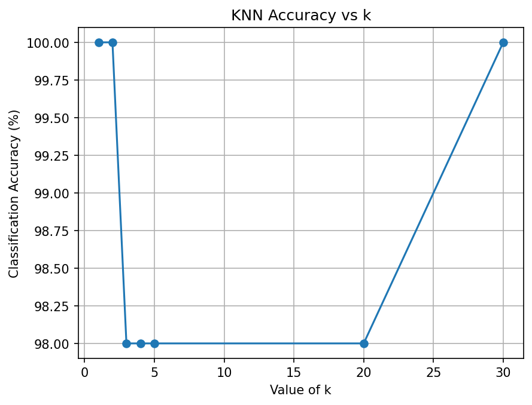
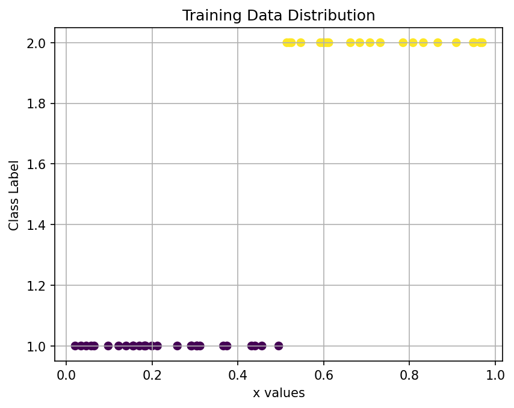

# 📌 KNN Classification on Randomly Generated Data

---

## 📖 Problem Statement

Generate 100 random values in the range **[0,1]**.

Label the first 50 samples as follows:

- If x_i ≤ 0.5 → Class 1  
- Else → Class 2  

Use:
- First 50 samples for training  
- Remaining 50 samples for testing  

Implement the **K-Nearest Neighbors (KNN)** classifier for:

k = 1, 2, 3, 4, 5, 20, 30  

Compute classification accuracy and analyze performance.

---

## 🎯 Objective

- Study the effect of varying **k**
- Understand the bias–variance tradeoff
- Evaluate classification accuracy
- Observe behavior of instance-based learning

---

## 🛠 Technologies Used

- Python
- NumPy
- Matplotlib
- Scikit-learn

---

## 📂 Project Structure

ML/
├── knn_assignment.py  
├── requirements.txt  
├── README.md  
├── outputs/  
│   ├── accuracy_vs_k.png  
│   └── training_distribution.png  
└── venv/  

---

## ▶️ How to Run

### 1️⃣ Create Virtual Environment

### 2️⃣ Activate Environment (Windows)

### 3️⃣ Install Dependencies

### 4️⃣ Run the Program

Graphs will be saved inside the **outputs/** folder.

---

## 📊 Results

The classifier achieved accuracy between **98% and 100%** for different values of k.

### Observations

- Small k values are sensitive to local variations.
- Larger k values produce smoother decision boundaries.
- Since the dataset is linearly separable, accuracy remains high.
- Demonstrates bias–variance tradeoff in KNN.

---

## 📈 Generated Outputs

### Accuracy vs k

### Training Data Distribution

---

## 📚 Theoretical Reference

Murty, M. N., and V. S. Ananthanarayana.  
*Machine Learning: Theory and Practice*, Universities Press.

Concept Applied: Instance-Based Learning (KNN)

---

## 🚀 Future Improvements

- Experiment with different threshold values
- Add noise near decision boundary
- Compare with Logistic Regression
- Extend to 2D data visualization